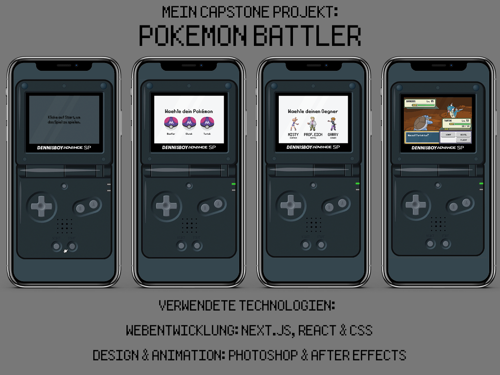

# Pokemon Battle App - Capstone Project at neuefische



Welcome to the Pokemon Battle App Capstone Project! This app is designed to let users compete against computer-controlled opponents in an exciting Pokemon battle. The app is written in Next.js and has three difficulty levels to challenge both beginners and experienced players. With a beautiful user interface, engaging gameplay, and strategic decision-making, immerse yourself in the world of Pokemon battles like never before!

## Features

- Three difficulty levels for players of all skill levels
- Stunning visuals and animations
- Engaging gameplay with strategic decision-making
- Responsive design for both desktop and mobile devices
- Sound effects and music to enhance the gaming experience

## Getting Started

To get started with the Pokemon Battle App, simply visit [Pokemon Battler](https://capstone-project-pokemon-battler-app.vercel.app/) and start playing! No installation is required; just open the link in your preferred web browser and enjoy.

## Technologies Used

- **Next.js** for server-rendered React applications
- **React** for building the user interface
- **Styled-components** for CSS styling in JS
- **Vercel** for deployment and hosting
- **Photoshop** for creating and editing visual assets
- **After Effects** for creating animations and visual effects

## How to Contribute

If you're interested in contributing to the Pokemon Battle App, please feel free to fork the repository and submit a pull request. We're always open to suggestions and improvements to make the app even more engaging and fun to use!

## Acknowledgements

This project is a capstone project completed at neuefische. We'd like to thank the entire neuefische team for their guidance, support, and encouragement throughout the development process.

But enough talking, just try out [Pokemon Battler](https://capstone-project-pokemon-battler-app.vercel.app/) and enjoy the thrilling battles!

<!-- ## Table of Contents

1. [Features]#features
2. [Installation]#installation
3. [Usage]#usage
4. [Technologies]
5. [Contributing]#contributing

### Features

- Choose from a variety of Pokemon to build your team
- Encounter computer-controlled opponents at three difficulty levels: Easy, Medium and Hard
- Battle in an attractive and user-friendly interface
- Develop your Pokemon strategies

### Installation

To install the Pokemon Battle app on your local machine, follow the steps below:

1. Make sure you have Node.js and npm installed.

2. Clone the repository to your computer:
   bash

```bash
git clone git@github.com:dennisbuchwald/capstone-project-pokemon-battler.git
```

3. Navigate to the project directory:

```bash
cd capstone-project-pokemon-battler
```

4. Install all necessary dependencies:

```bash
npm install
```

5. Start the development environment

```bash
npm run dev
```

The app should now be running on http://localhost:3000.

### Usage

After installing and launching the app, you can follow the steps below to start using the Pokemon Battle app:

1. Open your favorite web browser and navigate to `http://localhost:3000.`
2. On the home page, select the difficulty level you want for your battle: Easy, Medium, or Hard. -->
